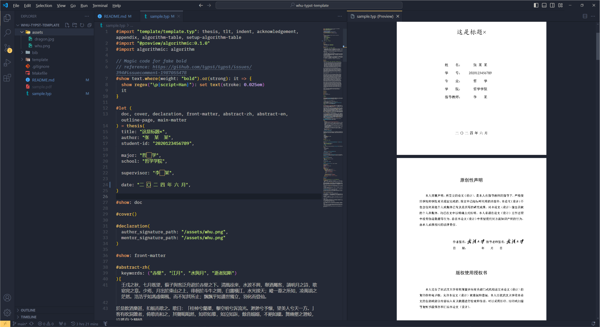

# WHU Typst Template

用于武汉大学本科毕业设计（论文）的 typst 模板。

## 什么是 typst

[typst](https://github.com/typst/typst) 是一个较新的标记文本语言，定位与 LaTeX 类似，具有极强的排版能力，通过一定的语法写文档，然后生成 pdf 文件。与 LaTeX 相比有以下的优势：

1. 编译巨快：因为提供增量编译的功能所以在修改后基本能在一秒内编译出 pdf 文件，typst 提供了监听修改自动编译的功能，可以像 Markdown 一样边写边看效果。
2. 环境搭建简单：原生支持中日韩等非拉丁语言，不用再大量折腾字符兼容问题以及下载好几个 G 的环境。只需要下载命令行程序就能开始编译生成 pdf。
3. 语法友好：对于普通的排版需求，上手难度跟 Markdown 相当，同时文本源码阅读性高：不会再充斥一堆反斜杠跟花括号

友校（HUST）学长的观点：跟 Markdown 一样好用，跟 LaTeX 一样强大。

可以从[这里速通 typst](https://typst.app/docs/tutorial)

跟 Word 比的优势：格式好调，玄学问题少。Word 功能强大，但是如果想要随心所欲地排版，学习成本将非常高。

## 说明

- 格式参照 2024 年新要求，模板有相当程度的肉眼排版内容，存在不被认可的风险，如果遇到不对的间距、字体等请提交 issue 说明，也欢迎 pull request 贡献。

- 原创性声明页面，为了使得插入手写的签名和日期看起来更美观，可以使用 [typst-pinit](https://github.com/OrangeX4/typst-pinit) 库。

- 推荐最终编译在 Windows 下本地编译进行。如果使用 Linux，可能会遇到一些字体配置上的问题。

- 作者用不明白 LaTeX 所以使用了 typst。作者使用该模板成功本科毕业（计算机学院）。

## 参考和致谢

- https://github.com/whutug/whu-thesis 武汉大学 LaTeX 模板
- https://github.com/werifu/HUST-typst-template 华中科技大学毕业论文 typst 模板
- https://github.com/nju-lug/modern-nju-thesis 南京大学毕业论文 typst 模板
- https://github.com/lf-/typst-algorithmic 本模板所使用的伪代码库
- https://github.com/OrangeX4/typst-pinit typst-pinit 库

---

---

东湖之滨，珞珈山上，

这是我们亲爱的学堂。

百年沧桑，弘毅自强，

根深叶茂育桃李，满园芬芳。

啊，美丽的珞珈山，

多少雄鹰竞翱翔、竞翱翔。

扬帆长江，奔向海洋，

这是我们成长的地方。

德业并进，求是拓新，

大同寰宇向未来，我创辉煌。

啊，心中的珞珈山，

今朝多磨砺，明日作栋梁、作栋梁。
